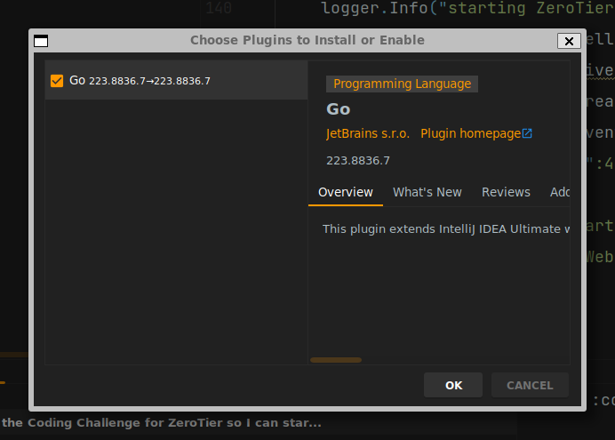
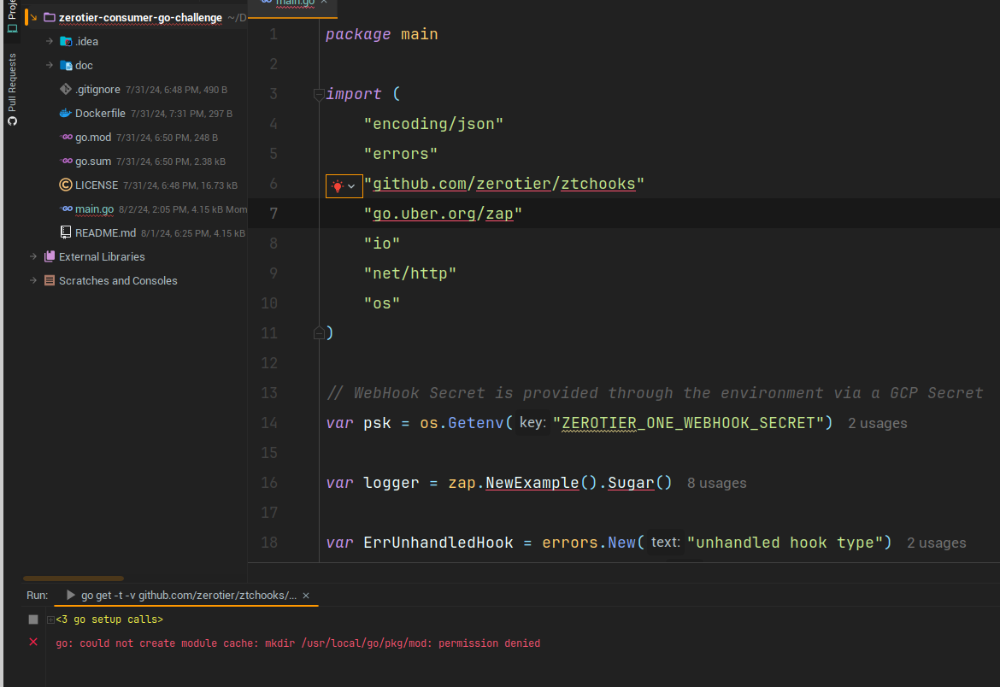
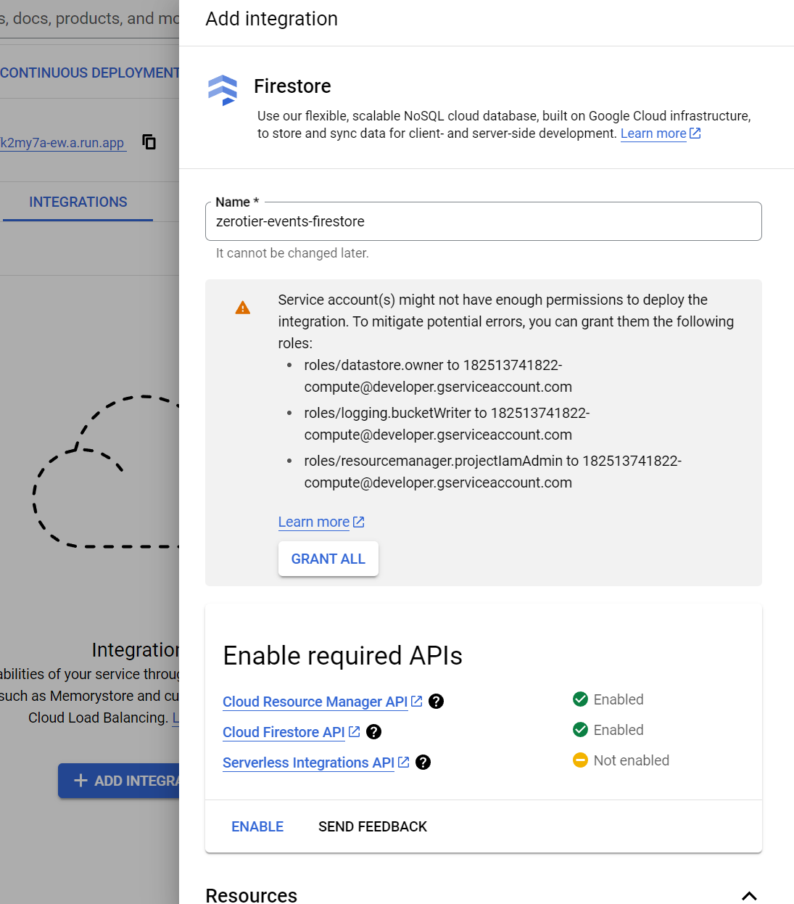
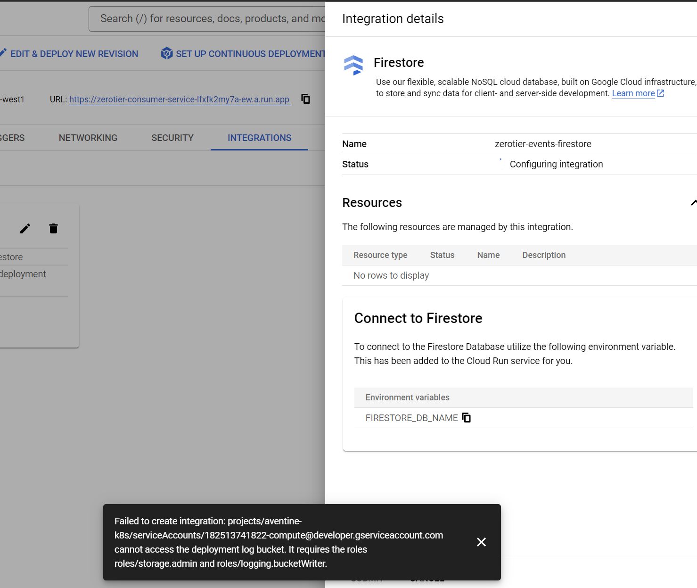
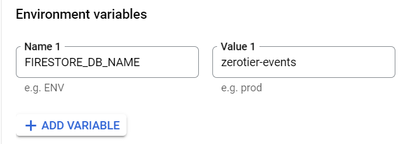

# zerotier-consumer-go-challenge
Coding Challenge for ZeroTier (Broccoli IT) Webhook Consumer written in GoLang

1. I worked on this locally using IntelliJ Ultimate on Pengwin WSL2 (WLinux)
2. The run was installed using my Google Cloud Platform account

# GoLang on Pengwin WSL2
* download [go1.22.5.linux-amd64.tar.gz](https://go.dev/dl/go1.22.5.linux-amd64.tar.gz)
```shell
sudo rm -rf /usr/local/go && sudo tar -C /usr/local -xvf <downloadFolder>/go1.22.5.linux-amd64.tar.gz
export GOROOT=/usr/local/go
go version go1.22.5 linux/amd64
```

# Docker on Pengwin WSL2
```shell
sudo apt install ca-certificates curl gnupg lsb-release
curl -fsSL https://download.docker.com/linux/debian/gpg | sudo gpg --dearmor -o /usr/share/keyrings/docker-archive-keyring.gpg
chmod -v 700 /home/matthew/.gnupg
echo "deb [arch=$(dpkg --print-architecture) signed-by=/usr/share/keyrings/docker-archive-keyring.gpg] https://download.docker.com/linux/debian $(lsb_release -cs) stable" \
  | sudo tee /etc/apt/sources.list.d/docker.list > /dev/null
sudo apt update
sudo apt upgrade
sudo apt install docker-ce docker-ce-cli containerd.io
sudo usermod -aG docker $USER
sudo /etc/init.d/docker start
# re-login for the Unix Group change
```

# IntelliJ Ultimate on Pengwin WSL2



# Docker Build
```shell
# build
docker build .
docker images # find image ID
# test
docker run -p 4444:4444 a4b0dae69173
```
# Google Cloud Platform [GCP] Deployment
* Authenticate with GCP
```shell
gcloud auth login
```
* Ensure the default Project is set in configurations
```shell
gcloud config configurations list                                        
NAME     IS_ACTIVE  ACCOUNT                       PROJECT       COMPUTE_DEFAULT_ZONE  COMPUTE_DEFAULT_REGION
default  True       aventine.solutions@gmail.com  aventine-k8s
```
* Set up a Docker Image Repository in "Artifact Registry" for the Project if there isn't one already (in this case
  we are using the Balfour Datacenter `europe-west1`)
* Configure Docker for pushing our image to this Repository
```shell
gcloud auth configure-docker europe-west1-docker.pkg.dev
```
* Tag our Docker image
```shell
docker tag a4b0dae69173 zerotier-consumer-service:0.1.0-beta1
docker tag zerotier-consumer-service:0.1.0-beta1  europe-west1-docker.pkg.dev/aventine-k8s/aventine/zerotier-consumer-service:0.1.0-beta1
```
* Push to our GCP Repository
```shell
docker push europe-west1-docker.pkg.dev/aventine-k8s/aventine/zerotier-consumer-service:0.1.0-beta1
```
* Use "Cloud Run" to deploy our web service managed by GCP (serverless)
```shell
gcloud run deploy zerotier-consumer-service --image europe-west1-docker.pkg.dev/aventine-k8s/aventine/zerotier-consumer-service:0.1.0-beta1 \
  --platform managed --port 4444 --region europe-west1
```
* Check the logs of the running service
* Add a Liveness Health check to the service using `livez`
* Copy the Engress URL Google has given you and check access using `curl` and `hello` ... for example
```shell
curl -vvv https://zerotier-consumer-service-lfxfk2my7a-ew.a.run.app/hello
...
* Request completely sent off
* TLSv1.3 (IN), TLS handshake, Newsession Ticket (4):
* TLSv1.3 (IN), TLS handshake, Newsession Ticket (4):
* old SSL session ID is stale, removing
< HTTP/2 200 
< content-type: application/json
< x-cloud-trace-context: cffd706698451f1cd1c7f159b66dc50d;o=1
< date: Thu, 01 Aug 2024 14:47:21 GMT
< server: Google Frontend
< content-length: 56
< alt-svc: h3=":443"; ma=2592000,h3-29=":443"; ma=2592000
< 
{"type":"hello","message":"Hello, Aventine Solutions!"}
* Connection #0 to host zerotier-consumer-service-lfxfk2my7a-ew.a.run.app left intact
```
# GCP Secret for the ZeroTier Webhook
* use your account in Central to create a Webhook Signing Secret value
* create a Secret `ZeroTierOneTestWebhook` in "Secret Manager" which contains this Webhook Signing Secret value

# Things to Make this Service Production Ready
* Using GitOps, it needs a pipeline to run tests, build, tag and push the image to GCP "Artifact Registry";
  this could be done using GCP "Cloud Build"

# Firestore Database and Integration with Cloud Run


```shell
gcloud projects add-iam-policy-binding \
  aventine-k8s \
  --member=serviceAccount:182513741822-compute@developer.gserviceaccount.com \
  --role=roles/storage.admin
gcloud projects add-iam-policy-binding \
  aventine-k8s \
  --member=serviceAccount:182513741822-compute@developer.gserviceaccount.com \
  --role=roles/logging.bucketWriter
```


# Improvements to Make This More Production Ready
* It seems my error handling is pretty primitive; explore the best practices of handling errors and exceptions
  in Go
* use Go Packages and "layering"for _Separation of Concerns_ ... for example, to encapsulate Routing, Handlers, 
  Persistence and Marshalling of Parameters better; this was not straight forward for me because it is
  not an Object Oriented language where I could declare Classes and Objects.
* I would like to have a Global Static Logger, but I'm not yet sure how to do that.
* Explore the threading model in Go and if scalability can be achieve with Firestore Connection Pooling
* Production readiness would mean a fully defined, self-documenting (Swagger) API with versioning